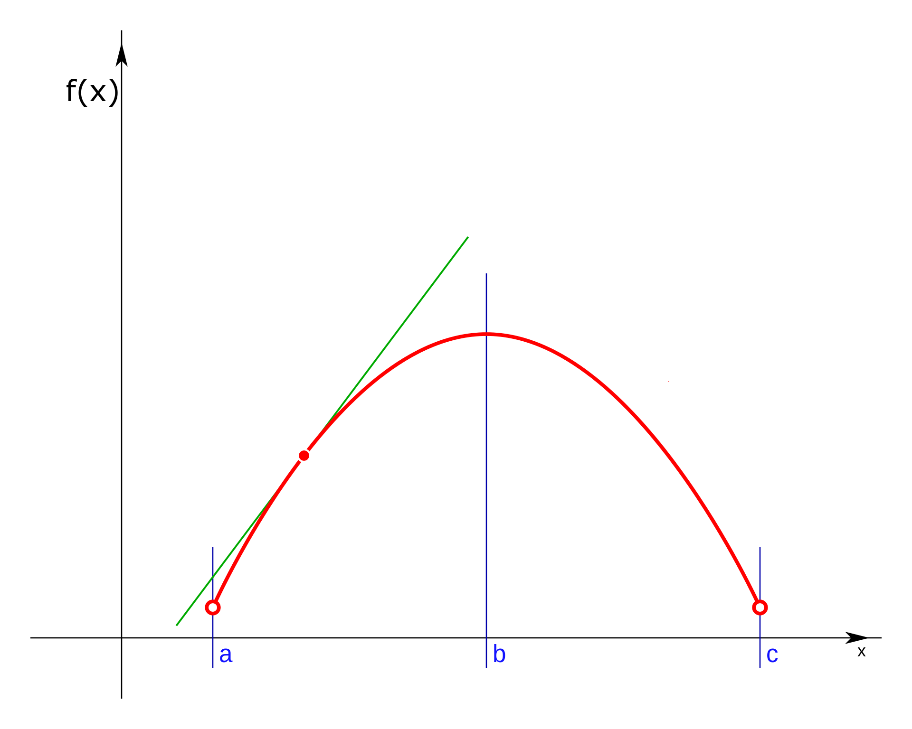
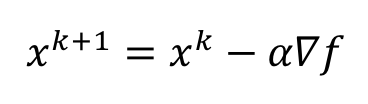

# El descenso del gradiente

El algoritmo del descenso del gradiente es un método clásico para resolver problemas de optimización. Los métodos clásicos se basan en el uso del gradiente de la función. Por lo que, el gradiente es un vector que contiene todas las derivadas parciales de dicha función.

#### ¿Por qué el algoritmo usa la derivada?
Si observas la imagen, la derivada de la función en el punto marcado es equivalente a la pendiente de la recta tangente.

Por lo que este algoritmo pretende localizar la mayor pendiente en la posición actual. Normalmente los problemas de optimización contienen más de una variable esto quiere decir que son multidimensionales.

#### ¿Por qué derivadas parciales?

Se debe a que, calculando la derivada parcial de cada variable nos dará su respectiva pendiente. Por lo tanto, el conjunto de todas las derivadas parciales conforma un vector que indica la dirección hacia la que la pendiente asciende el cual como se mencionó anteriormente es el gradiente. Una forma muy sencilla de entender el proceso del algoritmo es la siguiente: En este método se parte inicialmente en un punto, en el cual en la primera iteración se usa la información del gradiente, es decir, se evalúan el conjunto de todas las derivadas parciales para saber la dirección hacia donde el gradiente asciende sin embargo, como buscamos en este caso el mínimo global y no el máximo global el gradiente se multiplica por -1 como puede observarse en la imagen de abajo.

Bajo esta regla se garantiza que la nueva solución o el nuevo punto de evaluación sea siempre menor a la solución o punto actual. En la siguiente iteración el nuevo punto de evaluación estará tan lejos del primero dependiendo del valor del learning rate, en esta nueva iteración se repite el mismo proceso usando la información del gradiente y así sucesivamente hasta que se cumpla un numero determinado de iteraciones o la pendiente sea próxima a cero.

#### ¿Qué encontraré en este repositorio?

Además de la breve explicación mencionada en los párrafos de arriba encontrarás el algoritmo programado en python el cual es explicado e implementado en el video de [Aqui](https://youtu.be/t-n_dY0zinU "Aqui")
